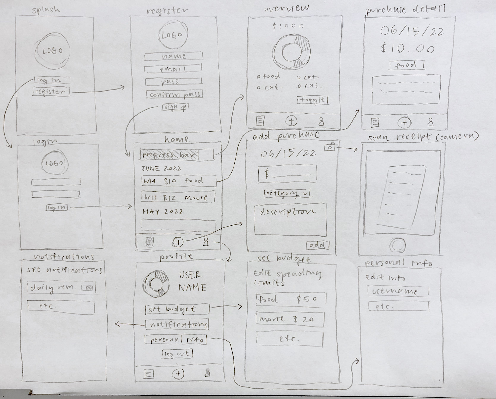
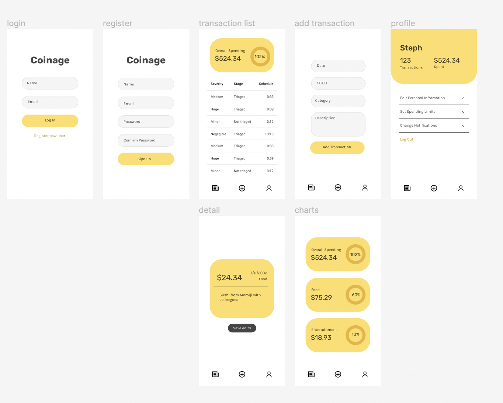

# coinage

## Table of Contents
1. [Overview](#Overview)
1. [Product Spec](#Product-Spec)
1. [Wireframes](#Wireframes)
2. [Schema](#Schema)

## Overview
### Description
Coinage is a finance app that allows users to track their purchases and set spending limits. The motivation behind the app is to promote mindful spending and to create a simple and enjoyable budgeting experience for those who are just becoming financially independent.

### Final Product

### App Evaluation
[Evaluation of your app across the following attributes]
- **Category:** Lifestyle / Finance
- **Mobile:** This app is uniquely mobile in that users should be able to access the app anytime and anywhere they want, and there will be a feature where users can use their phone’s camera to scan receipts.
- **Story:** Allows users to track their purchases and income and view how much they typically spend in different categories. If they wish to cap the amount of money they spend, they can set limits and review their progress.
- **Market:** Anyone wanting to become more conscious about their spending habits can use this app, but the app will be especially helpful for younger people who want a more hands-on and enjoyable budgeting experience.
- **Habit:** With daily push notifications, it can certainly become a habit to log on to the app everyday and track purchases.
- **Scope:** The MVP would include features to manually add purchases, view a timeline of transactions, and set spending limits. In later iterations, the app would develop to include a receipt scanning option, daily notifications, gesture controls, and thought-provoking toasts related to transactions added.

## Product Spec

### 1. User Stories (Required and Optional)

**Required Must-have Stories**

* Users can log in to or register an account.
* Users see a timeline of all the transactions they’ve added organized by month.
* Users can set spending limits and view their progress.
* Users can log a purchase, add it to their timeline, and click to view its details.
* Users can scan a receipt to quickly add transactions to the timeline.
* Settings (set spending limits, edit notifications, personal information, log out)

**Optional Nice-to-have Stories**

* Daily notifications remind users to log their transactions on the app.
* Users get toasts related to their purchases every time they log a transaction.
* Users can export their transactions to Google Sheets.
* Gesture controls streamline the user experience.
* Users can link their Venmo account and automatically add transactions on Venmo.
* Users can view their timeline in different layouts (calendar, line graph, etc.)

More details in the PRD: https://docs.google.com/document/d/1F6qHZ98POQ-CXGzxLPpMcRKedWLqjuXrvBz6-VeggGE 

### 2. Screen Archetypes

* Login/Register
* Stream
   * Timeline of transactions
* Profile
   * View spending limits and categories
* Detail
   * View or edit purchase details (date, amount, category, description)
* Creation
   * Add transactions
* Settings
   * Change notifications, spending limits, personal information
   * Log out

### 3. Navigation

**Tab Navigation** (Tab to Screen)

* Timeline
* Add transaction
* Profile

**Flow Navigation** (Screen to Screen)

* Login/Register -> Timeline
* Timeline -> Spending limit overview (profile)
* Timeline -> Transaction details
* Add transaction -> Scan receipt -> Timeline
* Settings -> Set spendingLimit (or any other settings screen)

## Wireframe

## Schema

### Models

* User
   * String name
   * String email
   * String password
   * Transaction List transactions

* Transaction
   * String date
   * Float amount
   * String category
   * String description
   * User user

* SpendingLimit
  * Float amount
  * String category
  * User user

### Networking

More details in the TDD:
https://docs.google.com/document/d/1uZGRYRlgAqDUR-Wb5c5Kkn8Asb4KCsr2w_WISfdTmJw 
